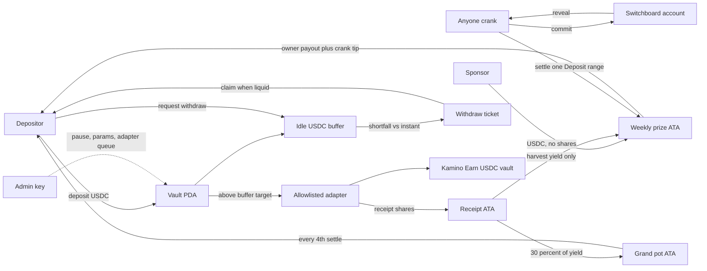
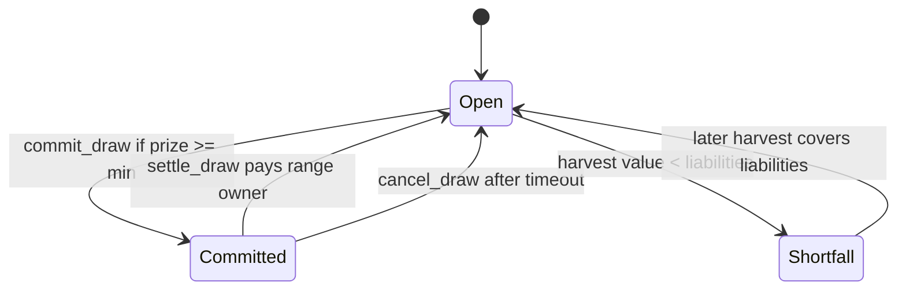

# Cryptoball lossless architecture diagram

Revised after `threat-model.md`. Money never moves on a dotted line.

## Money and trust

Solid arrows move tokens or open a ticket. The admin arrow is a config write. It does not touch principal, prize, or grand.

## Draw state

Pause is a flag on top of these states. It blocks deposit and commit. It does not block withdraw, claim, settle, or cancel.

## Winner check

Commit stores `supply_snapshot` and the randomness account. The winning index is the revealed word reduced into `[0, supply_snapshot)` with rejection sampling. Settle passes one Deposit. The program pays only if `range_start <= index < range_start + shares` and `eligible_after <= commit_slot`. No loop over depositors.

## What the threat model removed from the diagram

No bridge box. No Jupiter swap. No lending-reserve account list. No admin withdrawal. No path from the prize ATA back into the adapter. Donations to the principal ATA are not an input to share price.
